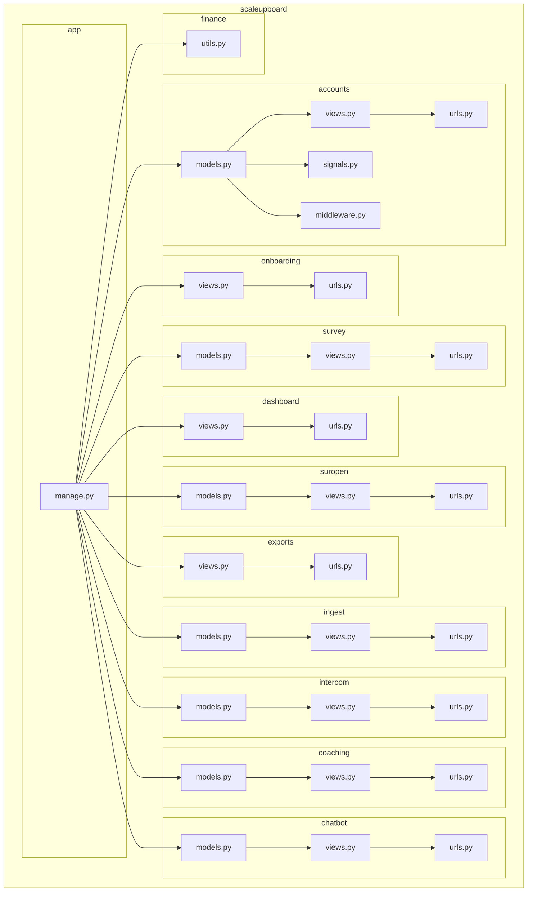

    

    <b>Automatic Architecture Diagrams from Code</b> 
    <a href="https://github.com/swark-io/swark">GitHub</a> • <a href="https://swark.io">Website</a> • <a href="mailto:contact@swark.io">Contact Us</a>

## Usage Instructions

1. **Render the Diagram**: Use the links below to open it in Mermaid Live Editor, or install the [Mermaid Support](https://marketplace.visualstudio.com/items?itemName=bierner.markdown-mermaid) extension.
2. **Recommended Model**: If available for you, use `claude-3.5-sonnet` [language model](vscode://settings/swark.languageModel). It can process more files and generates better diagrams.
3. **Iterate for Best Results**: Language models are non-deterministic. Generate the diagram multiple times and choose the best result.

## Generated Content
**Model**: GPT-4o - [Change Model](vscode://settings/swark.languageModel)  
**Mermaid Live Editor**: [View](https://mermaid.live/view#pako:eNqVlc1uqzAQhV8l8rqtBGk3WVypjfkJ6a53B104ZgJIwUbGbhtVffe6xVBNiqXC7vAx58xMHHgnXJZANqQQlWJdvfpPC7GyV28Ow42esxOY7iCZKgeEMOu6n7tf132Qt0ywCm668_MPAmGr5-o5l0boHps8WBPb16nHJt8ozF8aeJ0j69yo2ZLbvG8qwWbZXd42ZXmCV6b-2LIU38toRIWttoGvs20405nPvjfqBc7YgPr3Qb37oOtlqbIDgR0if2zkjY2WxNolQq-xQexPjb2p8bJUDYrLFlsk_tzEm5ssyeWS8frXuUn9uak3N12SW7K-vvgDf10774HdLTmwvGb6IC9-xMw_VOYdKlsyFLx1Ul2-OPbekfZLRjo2ggkO2OExyI1uZi0uvO6D1fX1P_sWQ3KLJcUywjLGMsEyxXKHZYblHsvHYGzzwbUZOhkOco3pLZZ3Y_XWTRWON6iby9nRwY6uRx65QR2PBh5NPHaTOx4PPJ544lbheDLwZOKp243j6cDTie_csqaGM7cuV5ANBdlUsHf7s5xckRZUy5rSfivfC6JraKEgm1VBSjgyc9IF-bAPma5kGmjD7DlqyUYrA1eEGS2fzoKPWklT1WRztB8k-PgEK3H5SA) | [Edit](https://mermaid.live/edit#pako:eNqVlc1uqzAQhV8l8rqtBGk3WVypjfkJ6a53B104ZgJIwUbGbhtVffe6xVBNiqXC7vAx58xMHHgnXJZANqQQlWJdvfpPC7GyV28Ow42esxOY7iCZKgeEMOu6n7tf132Qt0ywCm668_MPAmGr5-o5l0boHps8WBPb16nHJt8ozF8aeJ0j69yo2ZLbvG8qwWbZXd42ZXmCV6b-2LIU38toRIWttoGvs20405nPvjfqBc7YgPr3Qb37oOtlqbIDgR0if2zkjY2WxNolQq-xQexPjb2p8bJUDYrLFlsk_tzEm5ssyeWS8frXuUn9uak3N12SW7K-vvgDf10774HdLTmwvGb6IC9-xMw_VOYdKlsyFLx1Ul2-OPbekfZLRjo2ggkO2OExyI1uZi0uvO6D1fX1P_sWQ3KLJcUywjLGMsEyxXKHZYblHsvHYGzzwbUZOhkOco3pLZZ3Y_XWTRWON6iby9nRwY6uRx65QR2PBh5NPHaTOx4PPJ544lbheDLwZOKp243j6cDTie_csqaGM7cuV5ANBdlUsHf7s5xckRZUy5rSfivfC6JraKEgm1VBSjgyc9IF-bAPma5kGmjD7DlqyUYrA1eEGS2fzoKPWklT1WRztB8k-PgEK3H5SA)

