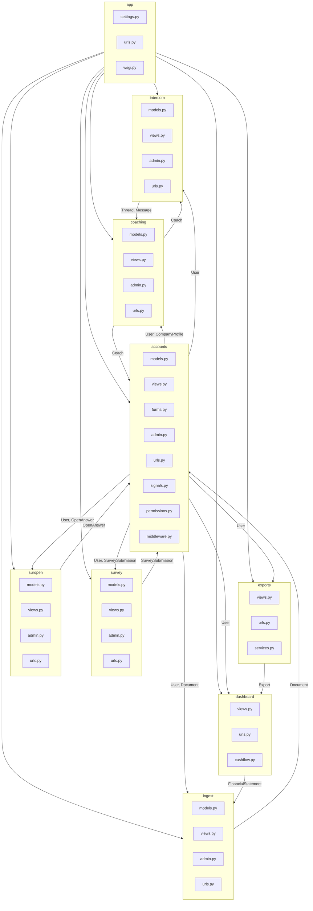

    

    <b>Automatic Architecture Diagrams from Code</b> 
    <a href="https://github.com/swark-io/swark">GitHub</a> • <a href="https://swark.io">Website</a> • <a href="mailto:contact@swark.io">Contact Us</a>

## Usage Instructions

1. **Render the Diagram**: Use the links below to open it in Mermaid Live Editor, or install the [Mermaid Support](https://marketplace.visualstudio.com/items?itemName=bierner.markdown-mermaid) extension.
2. **Recommended Model**: If available for you, use `claude-3.5-sonnet` [language model](vscode://settings/swark.languageModel). It can process more files and generates better diagrams.
3. **Iterate for Best Results**: Language models are non-deterministic. Generate the diagram multiple times and choose the best result.

## Generated Content
**Model**: GPT-4o - [Change Model](vscode://settings/swark.languageModel)  
**Mermaid Live Editor**: [View](https://mermaid.live/view#pako:eNqNVdtymzAU_BVGz04_wA-dIXacW9OktdM2hT7I0jFoBiRGF7uekH-vjE0BcZqaJ1j2aM8uR-iVMMWBTEkqM02rPFrNUxn5y7j1EaBVdUQOV5wYsFbIzHyo9r86_DJxugiwWbIzmegwkDyV4eKMKSet6armSekbCte6SrYCdgG4SDZKlwF4nVBeCjkEb5D2bhMjMklD-C6pQJfCGKFk8Oo-KQXnBeyohvdtMUVZ7lPqaj-hth4wW58xB4-BA0zVOL2FfVfzhGp-wTS_YprL8zRVBbIrWqGiz5joN0z0-xmiPlkwtqv5gWq-YJo_Mc04PkOUU5OvFdW8V3eJScQzZNriecL8AptC7d6Xgd-V0v0NEaOzHy8wkWu_PfVWMPhvgBY0U2Wv9AbNML5Fxe_QFO__naL_iUQXFx-D_d6iw-3Sov1x7mHduLVgfxxaLPhaLTxIt6tv0zjhpyYPL-tnn-gkmqmyonL_pNVGFFCHHY8Llk3zS7c-_UrqoZ1xwaO3FUuzA10HLsfcuWKuBGnrofWQWI9SGDOGgYzfh9m0xhvK7PBQBx8VY4SrHLNoGOOghsudsmi4_YyGrGMODakLZ0j5m0XDWghJJRO0WFpqYRzmKZeGe9Xcj9JsTTWcVa6B8kn0AMbQbDAhZEJKf6RQwf0x-5oSm3u9lEyjlHDYUFfYlLx5kqu4b2UuqN-jJZla7WBCqLNquZesfdbKZTmZbvy5BW9_ADbXeLM) | [Edit](https://mermaid.live/edit#pako:eNqNVdtymzAU_BVGz04_wA-dIXacW9OktdM2hT7I0jFoBiRGF7uekH-vjE0BcZqaJ1j2aM8uR-iVMMWBTEkqM02rPFrNUxn5y7j1EaBVdUQOV5wYsFbIzHyo9r86_DJxugiwWbIzmegwkDyV4eKMKSet6armSekbCte6SrYCdgG4SDZKlwF4nVBeCjkEb5D2bhMjMklD-C6pQJfCGKFk8Oo-KQXnBeyohvdtMUVZ7lPqaj-hth4wW58xB4-BA0zVOL2FfVfzhGp-wTS_YprL8zRVBbIrWqGiz5joN0z0-xmiPlkwtqv5gWq-YJo_Mc04PkOUU5OvFdW8V3eJScQzZNriecL8AptC7d6Xgd-V0v0NEaOzHy8wkWu_PfVWMPhvgBY0U2Wv9AbNML5Fxe_QFO__naL_iUQXFx-D_d6iw-3Sov1x7mHduLVgfxxaLPhaLTxIt6tv0zjhpyYPL-tnn-gkmqmyonL_pNVGFFCHHY8Llk3zS7c-_UrqoZ1xwaO3FUuzA10HLsfcuWKuBGnrofWQWI9SGDOGgYzfh9m0xhvK7PBQBx8VY4SrHLNoGOOghsudsmi4_YyGrGMODakLZ0j5m0XDWghJJRO0WFpqYRzmKZeGe9Xcj9JsTTWcVa6B8kn0AMbQbDAhZEJKf6RQwf0x-5oSm3u9lEyjlHDYUFfYlLx5kqu4b2UuqN-jJZla7WBCqLNquZesfdbKZTmZbvy5BW9_ADbXeLM)

